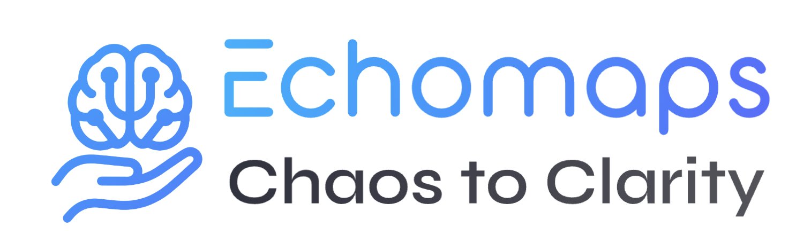
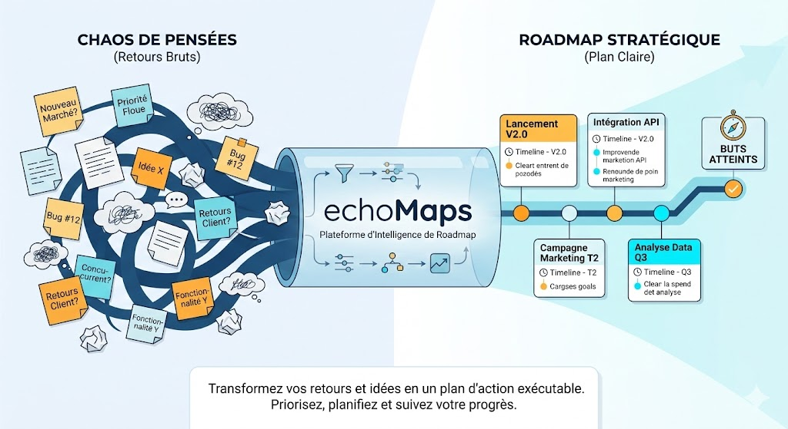

<div align="center">
  
  <br /><br />
  <h1>EchoMaps — Chaos to Clarity</h1>
  <p><strong>EchoMaps</strong> transforms a chaotic voice/text brain dump into a structured, actionable roadmap in real-time.<br />
  Built for the <strong>Mistral Worldwide Hackathon 2026</strong>.</p>
  <br />
  
</div>

<br />

## ✨ Features

- 🎤 **Voice-First** — speak your mind, watch ideas appear instantly (Voxtral WebSocket STT)
- 🧠 **AI Structuring** — Mistral Large organizes your dump into a JSON roadmap (AWS Bedrock)
- 📋 **Priority Matrix** — drag & drop tasks by urgency/importance
- 🗺️ **Visual Roadmap** — clean vertical timeline
- 🔁 **Interactive Revision** — refine the plan conversationally via `POST /revise`
- 🔒 **Type-Safe** — TypeScript strict + Zod validation on all LLM outputs

## 🛠️ Tech Stack

| Layer      | Tech                                                            |
| ---------- | --------------------------------------------------------------- |
| Frontend   | Next.js 16 (App Router) + TailwindCSS + Framer Motion           |
| Backend    | Node.js / Express (TypeScript)                                  |
| AI         | AWS Bedrock → Mistral Large (`mistral.mistral-large-2402-v1:0`) |
| Voice      | Voxtral WebSocket SDK                                           |
| Infra      | AWS Amplify Hosting, Lambda, CloudWatch                         |
| Validation | Zod                                                             |

## 🚀 Getting Started

### Prerequisites

- Node.js v18+
- AWS Account with Bedrock access (Mistral Large enabled)
- Voxtral API Key

### Setup

From the **repo root** (monorepo avec workspaces) :

```bash
git clone <repo-url>
cd Mistral-Worldwide-Hackathon-2026
npm install

# Backend : copier l’env
cp app/backend/env.example app/backend/.env
# Éditer app/backend/.env (AWS, Voxtral, etc.)
```

### Lancer l’app

| Commande                                                                | Usage                                                                                                                                                           |
| ----------------------------------------------------------------------- | --------------------------------------------------------------------------------------------------------------------------------------------------------------- |
| `npm run dev`                                                           | **Recommandé en local.** Backend + frontend en mode développement (hot reload). Aucun build requis.                                                             |
| `npm run start`                                                         | Backend en prod (`node dist/`) + frontend en **mode dev** (`next dev`). Pratique pour tester sans faire `next build`. Le frontend ne sert pas un build de prod. |
| `npm run build` puis `npm run start:backend` + `npm run start:frontend` | Vraie prod : backend et frontend servent les artefacts compilés. `next start` exige un `next build` préalable (dossier `.next`).                                |

**Nuance importante :** `next start` (frontend prod) ne fonctionne que si un build existe (`.next`). Le script racine `npm run start` lance donc le frontend en `next dev` pour éviter l’erreur « Could not find a production build ». Pour servir le frontend en prod, lancer `npm run build` puis `npm run start:frontend` (ou les deux `start:*` après un build).

- Frontend : **http://localhost:3000**
- Backend API : **http://localhost:4000**

### Environment Variables

```env
MISTRAL_API_KEY=...
AWS_REGION=eu-west-1
AWS_ACCESS_KEY_ID=...
AWS_SECRET_ACCESS_KEY=...
```

## 🔄 User Flow

1. **Speak** — click mic, speak your brain dump
2. **Transcribe** — text appears in real-time (optimistic UI)
3. **Structure** — AI generates a JSON roadmap via Bedrock
4. **Organize** — drag tasks in Priority Matrix
5. **Refine** — "Move X to urgent" → `POST /revise` → updated plan

## 📂 Project Structure

```
.
├── agents.md            # Agent roles, vibe, coding rules
├── changelog.md         # Keep a Changelog format
├── docs/
│   └── initial-idea.md  # Pitch, JSON schema, 48h roadmap
├── PRPs/                # Product Requirement Prompts
│   ├── README.md        # PRP workflow guide
│   ├── base_template_v1.md
│   └── [feature].md
├── commands/
│   ├── create-prp.md    # /create-prp [feature description]
│   └── explore-and-plan.md  # /explore-and-plan [PRP path]
├── skills/              # Reusable AI agent skills
│   ├── next-best-practices/
│   ├── backend-patterns/
│   ├── prompt-engineering/
│   ├── speech-to-text/
│   ├── aws-solution-architect/
│   └── ui-ux-pro-max/
├── app/
│   ├── frontend/        # Next.js app
│   │   ├── app/         # App Router routes/pages
│   │   ├── components/  # Atomic UI components
│   │   └── lib/         # shared frontend logic/types
│   └── backend/         # Express API (TypeScript)
│       └── src/
│           ├── routes/
│           └── prompts/
```

## 🧠 JSON Schema

```jsonc
{
    "projectId": "179b1942-7527-4968-9ca5-02f14dfcce96",
    "title": "Work and Sport Organization",
    "createdAt": "2026-02-28T20:23:13.000Z",
    "brainDump": "I want to go work out but before that I have some work to do",
    "objectives": [
        {
            "id": "obj-1",
            "text": "Finish the ongoing work",
            "priority": "high",
        },
        {
            "id": "obj-2",
            "text": "Go do some sport",
            "priority": "medium",
        },
    ],
    "tasks": [
        {
            "id": "task-1",
            "title": "Identify the work tasks to complete",
            "objectiveId": "obj-1",
            "status": "backlog",
            "estimate": "S",
            "priority": "high",
            "dependsOn": [],
        },
        {
            "id": "task-2",
            "title": "Complete the priority work",
            "objectiveId": "obj-1",
            "status": "backlog",
            "estimate": "M",
            "priority": "high",
            "dependsOn": ["task-1"],
        },
        {
            "id": "task-3",
            "title": "Prepare sports gear",
            "objectiveId": "obj-2",
            "status": "backlog",
            "estimate": "S",
            "priority": "medium",
            "dependsOn": [],
        },
        {
            "id": "task-4",
            "title": "Go to the gym",
            "objectiveId": "obj-2",
            "status": "backlog",
            "estimate": "M",
            "priority": "medium",
            "dependsOn": ["task-2", "task-3"],
        },
    ],
    "revisionHistory": [],
}
```

## 🤖 Vibe Coding Workflow

```bash
# 1. Create a PRP for the next feature
/create-prp Implement real-time Voxtral transcription

# 2. Explore codebase, plan & implement
/explore-and-plan PRPs/Voxtral-transcription.md
```

See `PRPs/README.md` for the full PRP workflow.

## 📜 API Endpoints

| Endpoint           | Role                             |
| ------------------ | -------------------------------- |
| `POST /transcribe` | Audio → text (Voxtral)           |
| `POST /structure`  | Text → structured JSON (Bedrock) |
| `POST /revise`     | Patch existing plan (Bedrock)    |
| `GET /project/:id` | Retrieve saved project           |

## 🧑‍💻 Team (48h Hackathon)

- **Dev 1** — Frontend (WebAudio, Timeline/Roadmap UI)
- **Dev 2** — Backend (API Gateway, Lambda, Auth)
- **Dev 3** — AI (Prompts, JSON schema, Voxtral loop)
